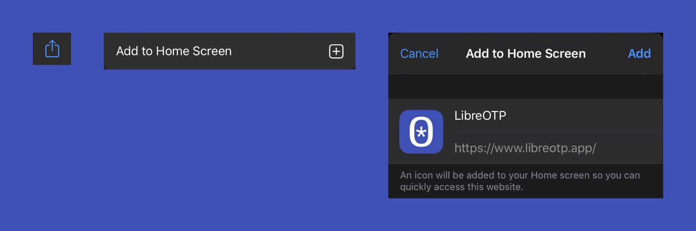

# LibreOTP

LibreOTP is an open source two-factor authentication web application for systems utilizing one-time password protocols.

LibreOTP supports:

* TOTP
* Multiple accounts
* QR code scanning
* Search bar
* Encryption

## How to install

### iPhone

Open https://www.libreotp.app with Safari

### Android

Open https://www.libreotp.app with Chrome

